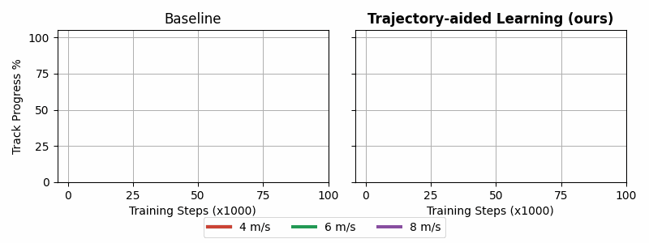

# TrajectoryAidedLearning

This repo contains the source code for the paper entitled, "[High-speed Autonomous Racing using Trajectory-aided Deep Reinforcement Learning](https://ieeexplore.ieee.org/document/10182327)"

We present a reward signal that incorporates an optimal trajectory to train deep reinforcement learning agents for high-speed autonomous racing.


Training agents with our reward signal results in significatly improved training performance.
The most noteable performance difference is at high-speeds where previous rewards failed.


The improved training results in higher average progrresses at high speeds.


# Result Generation

The results in the paper are generated through a two step process of:
1. Train and test the agents
2. Process and plot the data

For every test:
- Run calculate_statistics
- Run calculate_averages

## Tests:

### Maximum Speed Investigation

- Aim: Understand how performance changes with different speeds.
- Config files: CthSpeeds, TAL_speeds 
- Results: 
    - Training graph: Cth_TAL_speeds_TrainingGraph
    - Lap times and % success: Cth_TAL_speeds_Barplot

### 6 m/s Performance Comparision 

- Aim: Compare the baseline and TAL on different maps with a maximum speed of 6 m/s.
- Config file: Cth_maps, TAL_maps
- Results:
    - Training graphs: TAL_Cth_maps_TrainingGraph
    - Lap times and success bar plot: TAL_Cth_maps_Barplot

### Speed Profile Analysis 

- Aim: Study the speed profiles
- Requires the pure pursuit (PP_speeds) results
- Results:
    - Trajectories: GenerateVelocityProfiles, set the folder to TAL_speeds
    - Speed profile pp TAL: TAL_speed_profiles
    - Speed profile x3: TAL_speed_profiles 
    - Slip profile: TAL_speed_profiles

### Comparison with Literatures

- Aim: Compare our method with the literature
- Results:
    - Bar plot: LiteratureComparison
- Note that the results from the literature are hard coded.




## Citation

If you find this work useful, please consider citing:
```
@ARTICLE{10182327,
    author={Evans, Benjamin David and Engelbrecht, Herman Arnold and Jordaan, Hendrik Willem},
    journal={IEEE Robotics and Automation Letters}, 
    title={High-Speed Autonomous Racing Using Trajectory-Aided Deep Reinforcement Learning}, 
    year={2023},
    volume={8},
    number={9},
    pages={5353-5359},
    doi={10.1109/LRA.2023.3295252}
}
```